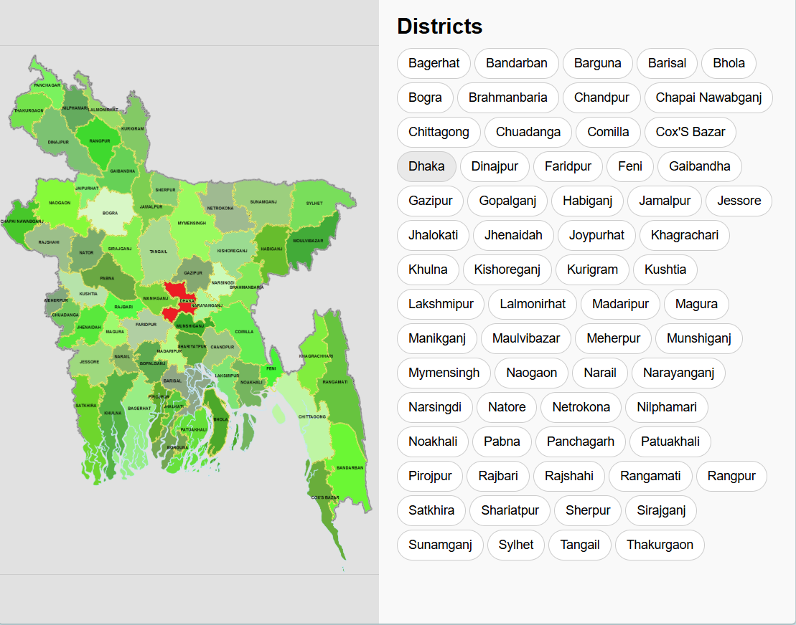

# Bangladesh District Maps

A collection of map images for Bangladesh districts, where each district is highlighted on a shared base map for seamless switching.

## Contents
- `bd.png` — Base map of Bangladesh
- `maps/` — Highlighted district images (PNG)
- `examples/` — Interactive demo webpage

## Quick Start
- View a district: Open `maps/districtname.png`
- Embed in HTML: ``

## Interactive Example
Demo in `examples/index.html` — hover district tags to highlight on map. Run `python -m http.server 8000` and visit `http://localhost:8000/examples/index.html`.

